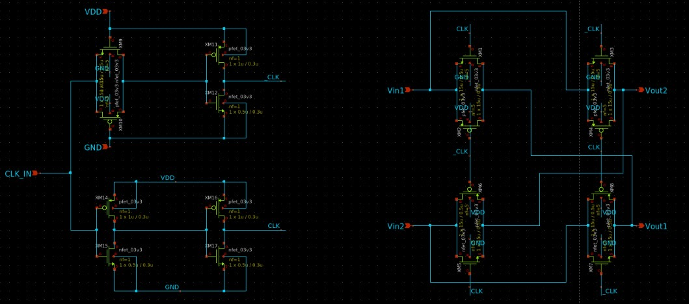
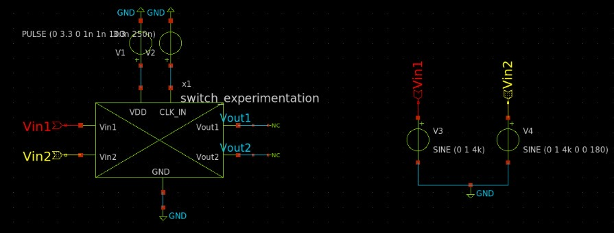
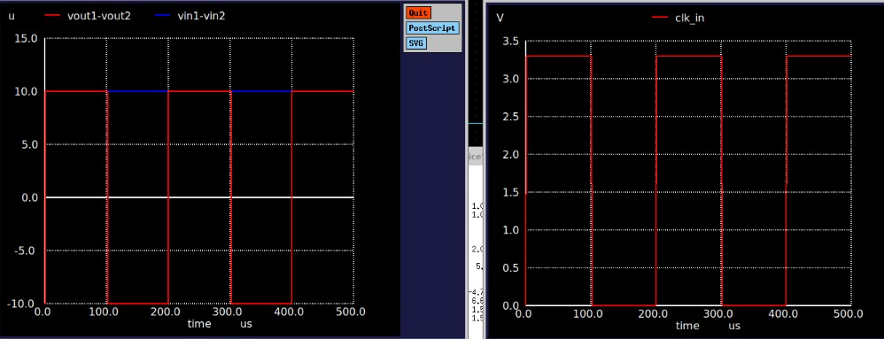

# Chopper Switch Progress Log

The chopper switch is implemented to reduce low-frequency (1/f) noise and input offset voltage that can severely degrade the quality of EEG signals. It operates by modulating the input signal with a square wave, shifting it to a higher frequency band where amplifier noise is more uniform and less intrusive. After amplification, the signal is demodulated back to baseband, effectively canceling out the low-frequency noise and offset introduced by the amplifier. 

## Target Specification

| **Parameter**                        | **Value / Target** | **Unit** |
|-------------------------------------|--------------------|----------|
| Chopper A Operating Frequency       | 2              | kHz       |
| Chopper B Operating Frequency       | 1            | kHz       |
| Chopper C Operating Frequency       | 500               | Hz       |
| Ron                                 | <1                | kΩ       |
| Delay tolerance between CLK and CLK̅ | <1              | us       |

## Schematic Design

  

<h4 align="center" style="font-size:16px;">Figure 1. Individual Chopper Switch Schematic</h4>

## Simulation

  

<h4 align="center" style="font-size:16px;">Figure 2. Individual Chopper Switch Testbench</h4>

  

<h4 align="center" style="font-size:16px;">Figure 3. Testbench Result</h4>

## Performance of Designed Chopper Switch 

| **Parameter**                        | **Value / Target** | **Unit** |
|-------------------------------------|--------------------|----------|
| Ron                                 | TBD                | kΩ       |
| Delay tolerance between CLK and CLK̅ | 0.107              | us       |

**Last Updated: 1st August**
