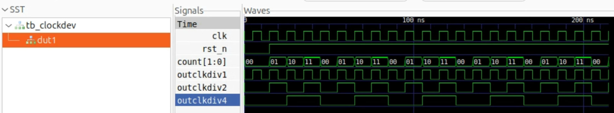
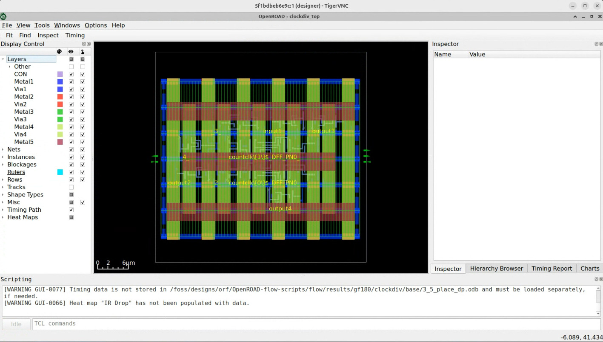

# Frequency Divider Progress Log

The frequency divider is designed to generate synchronized clock signals required by various timing-dependent blocks, such as the switched-capacitor LPF and chopper switch. It operates by dividing an input clock by two at each stage, producing sequentially halved frequencies (e.g., f, f/2, f/4, etc.) suitable for multi-stage operations. To ensure proper timing alignment and avoid glitches, a fixed delay of 500 ns is introduced at each division stage. This controlled delay spacing also helps with phase management and ensures predictable timing between clock signals, which is critical for maintaining accurate sampling and modulation sequences across the system.

To Simulate the Digital Component Netlist as .spice file, you **must have** the **clockdiv.lef.spice** and **clockdiv_tb.spice** provided in the **folder "Clock Divider Folder"**.

## Target Specification

| **Parameter**                        | **Value / Target** | **Unit** |
|-------------------------------------|--------------------|----------|
| Chopper A Operating Frequency       | 4              | kHz       |
| Chopper B Operating Frequency       | 2            | kHz       |
| Chopper C Operating Frequency       | 1               | kHz       |

## RTL Code

<pre>
module clockdiv2(
    input wire clk, // reference input clock
    input wire rst_n, // active low reset
    output wire outclkdiv1, // freq/1 clock
    output wire outclkdiv2, // freq/2 clock
    output wire outclkdiv4 // freq/4 clock
);

reg [1:0] count;

assign outclkdiv1 = clk;
assign outclkdiv2 = count[0];
assign outclkdiv4 = count[1];

always@(posedge clk or negedge rst_n)
begin
    if(!rst_n)
        count[1:0] <= 2'b00; 
    else
        count[1:0] <= count + 1'b1;
end
endmodule  
</pre>

## RTL Simulation Code

<pre>
`include "clockdiv2.v"
`timescale 1ns/1ps

module tb_clockdev();
reg clk;
reg rst_n;
wire clkdiv1;
wire clkdiv2;
wire clkdiv4;

clockdiv2 dut1 (
    .clk(clk),
    .rst_n(rst_n),
    .outclkdiv1(clkdiv1),
    .outclkdiv2(clkdiv2),
    .outclkdiv4(clkdiv4)
);

always #5 clk = ~clk;

initial 
begin
$dumpfile("tb_clockdev.vcd"); // For waveform with verilator
$dumpvars(0, tb_clockdev);

clk = 0;
rst_n = 0;

repeat(2)
begin
@(posedge clk);
end
rst_n = 1;

repeat(20)
begin
@(posedge clk);
end

$finish;

end
endmodule
</pre>

## RTL Simulation Result 

  

<h4 align="center" style="font-size:16px;">Figure 1. Frequency Divider Testbench Result</h4>

## Performance of Designed Chopper Switch 

| **Parameter**                        | **Value / Target** | **Unit** |
|-------------------------------------|--------------------|----------|
| Chopper A Operating Frequency       | 2              | kHz       |
| Chopper B Operating Frequency       | 1            | kHz       |
| Chopper C Operating Frequency       | 500               | Hz       |

## Layout of Designed Chopper Switch (in progress)

  

<h4 align="center" style="font-size:16px;">Figure 1. Frequency Divider Layout</h4>

**Last Updated: 1st August**
