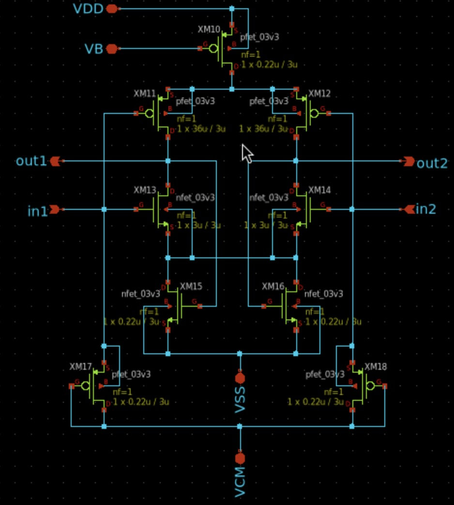

# Instrumentation Amplifier Progress Log

An open-loop amplifier is used to provide high gain for low-amplitude EEG signals while minimizing power and silicon area. Unlike closed-loop designs that require additional components such as compensation networks and feedback resistors, open-loop amplifiers offer a simpler architecture with fewer transistors and passive elements. This results in a significantly smaller layout footprint, making it ideal for compact, low-power multi-channel EEG systems where area efficiency is critical.

## Target Specification

| **Parameter**            | **Typical Value** | **Unit**   |
|----------------------|----------------|--------|
| Open-Loop Gain       | >50            | dB     |
| Bandwidth            | +/-10           | kHz     |
| Phase Margin         | >60           | degrees|
| UGF | 10 - 40 | MHz | 
| Power Supply Rejection Ratio (PSRR) | +/- 60  | dB     |
| Common-Mode Rejection Ratio (CMRR) | >= 80    | dB     |
| Power | < 500 | uW

## Schematic Design

  

<h4 align="center" style="font-size:16px;">Figure 1. Individual Instrumentation Amplifier Schematic</h4>

## Simulation

  

<h4 align="center" style="font-size:16px;">Figure 2. Instrumentation Amplifier Testbench</h4>

  

<h4 align="center" style="font-size:16px;">Figure 3. Gain Testbench Result</h4>

  

<h4 align="center" style="font-size:16px;">Figure 4. CMRR Testbench Result</h4>

## Performance of Designed Instrumentation Amplifier

| **Parameter**            | **Typical Value** | **Unit**   |
|----------------------|----------------|--------|
| Open-Loop Gain       | 52.65            | dB     |
| Bandwidth            | 10            | kHz     |
| Phase Margin         | TBD            | degrees|
| Power Supply Rejection Ratio (PSRR) | TBD    | dB     |
| Common-Mode Rejection Ratio (CMRR) | 95    | dB     |

Note* : PSRR, PM, and UGF Simulations are on-going simulations. Will be added later.

**Last Updated: 1st August**
