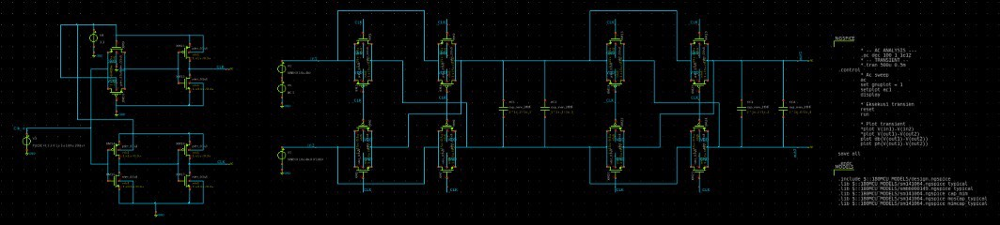

# Switched-Cap Low Pass Filter Progress Log

The switched-capacitor low-pass filter is used to remove high-frequency components after chopper demodulation, recovering the clean baseband EEG signal. Instead of relying on physical resistors, which can consume significant area and vary with process, the filter uses capacitor ratios and a clock signal to define its cutoff frequency precisely. This makes it highly area-efficient, tunable, and well-suited for integration in CMOS processes. The switching operation emulates a resistor using charge transfer, allowing for compact, accurate, and fully integrated filtering essential in low-power EEG front-end systems.

## Target Specification

| **Parameter**           | **Value**      | **Unit**   |
|-------------------------|-------------|--------|
| Cutoff Frequency (fc)  | 220        | Hz     |
| Clock Frequency (fclk) | 4         | kHz     |

## Schematic Design

  

<h4 align="center" style="font-size:16px;">Figure 1. Individual Switched-Cap Low Pass Filter Schematic</h4>

## Simulation

  

<h4 align="center" style="font-size:16px;">Figure 2. Switched-Cap Low Pass Filter Testbench</h4>

  

<h4 align="center" style="font-size:16px;">Figure 3. Testbench Result</h4>

## Performance of Designed Switched-Cap Low Pass Filter

| **Parameter**           | **Value**      | **Unit**   |
|-------------------------|-------------|--------|
| Cutoff Frequency (fc)  | TBD       | Hz     |
| Clock Frequency (fclk) | 4        | kHz     |
| Capacitor ) | 4        | farad    |

**Last Updated: 1st August**
