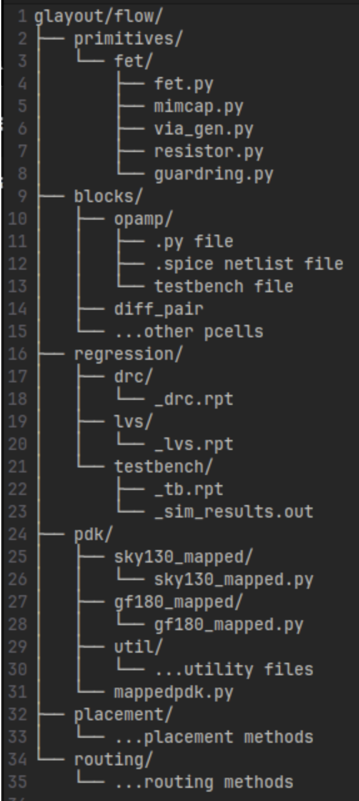
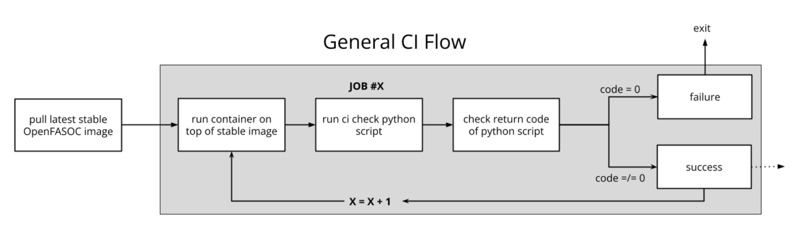
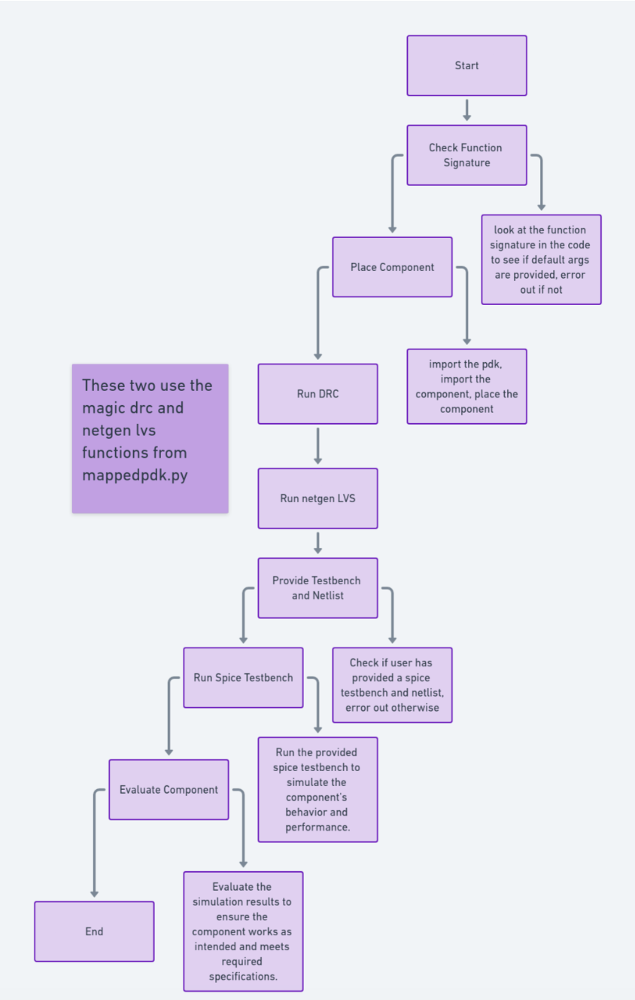

# Contributor Guidelines - How to use GLayout

## Running GLayout

Glayout is a Python-based code-to-layout framework that uses the GDSFactory in the backend to reduce the need to do manual analog layouts. Additionally, Glayout is a tool that generates DRC clean circuit layouts for any technology implementing the Glayout framework.

Glayout is composed of 2 main parts: the generic pdk framework and the circuit generators.

The generic pdk framework allows for describing any pdk in a standardized format. The `pdk` sub-package within Glayout contains all code for the generic pdk class (known as `MappedPDK`) in addition to sky130 and gf180 MappedPDK objects. Because MappedPDK is a python class, describing a technology with a MappedPDK allows for passing the pdk as a python object. The PDK generic circuit generator programs (also known as cells or components) are python functions which take as arguments a MappedPDK object and a set of optional layout parameters to produce a DRC clean layout.

## Important GDSFactory Notes and GLayout Utilities

The GDSFactory API is highly versatile, and there are many useful features. It takes some experience to learn about all features and identify the most useful tools from GDSFactory. GDSFactory serves as the backend GDS manipulation library and as an object-oriented tool kit with several useful classes including: Components, Component References, and Ports. There are also common shapes such as components in GDSFactory, such as rectangles, circles, rectangular_rings, etc. To automate common tasks that do not fit into GDSFactory, Glayout includes many utility functions.

### Component Functions

Components are the GDSFactory implementation of GDS cells. Components contain references to other components (Component Reference). Important methods:

- `Component.name`: get or set the name of a Component
- `Component.flatten()`: flattens all references in the components
- `Component.remove_layers()`: removes some layers from the component and return the modified component
- `Component.extract()`: extract some layers from a component and return the modified component
- `Component.ports`: dictionary of ports in the component
- `Component.add_ports()`: add ports to the component
- `Component.add_padding()`: add a layer surrounding the component
- Boolean operations: see the GDSFactory docs
- `Component.write_gds()`: write the gds to disk
- `Component.bbox`: return bounding box of the component (xmin,ymin),(xmax,ymax).
- `evaluate_bbox`: return the x and y dimensions of the bbox
- Insertion: `ref = Component << Component_to_add`
- `Component.add()`: add an one of several types to a Component. (more flexible than << operator)
- `Component.ref()`, `.ref_center()`: return a reference to a component

### ComponentReferences

- Component references are pointers to components. They have many of the same methods as Components with some additions
- `parent`: Component which this reference points to
- `movex`, `movey`, `move`
- `get_ports_list()`
- Use `Component.add()` to add references

### Ports

- Attributes: `width`, `center`, `orientation`, `layer`
- Examples: rectangle has ports e1, e2, e3, e4 (West, North, East, South)
- Use `rename_ports_by_orientation`, `rename_ports_by_list`functions and see below for port naming best practices guide
- `get_orientation`: returns the letter (N,E,S,W) or degrees of orientation of the port.by default it returns the one you do not have
- `assert_port_manhattan`: assert that a port or list or ports have orientation N, E, S, or W
- `assert_ports_perpendicular`: assert two ports are perpendicular
- `set_port_orientation`: return new port which is copy of old port but with new orientation
- `set_port_width`: return a new port which is a copy of the old one, but with new width
- `align_comp_to_port()`: pass a component or componentReference and a port, and align the component to any edge of the port.


### Port Naming Best Practices

- Use `_` in names for hierarchy. Think of this like a directory tree for files. Each time you introduce a new level of  hierarchy, you should add a prefix + "_" describing the cell.
- Names must end in `_N`, `_E`, `_S`, `_W`
- Call `rename_ports_by_orientation` before returning
- USE PORTS: be sure to correctly add and label ports to components you make

## Pcells (Implemented and Otherwise)

The currently implemented parametric cells, and planned cells can be found in this [sheet](https://docs.google.com/spreadsheets/d/1KGBN63gHc-hpxVrqoAoOkerA7bl1-sZ44X4uEn-ILGE/edit?gid=0#gid=0).
Contributors are encouraged to implement unimplemented Pcells. Refer to docstrings for implemented ones.

## Creating Components

1. Fork the repo and install tools
2. Create your component folder under `glayout/flow/blocks/`
3. Mandatory files:
   - `.py` layout generation file
   - `.spice` netlist
   - testbench
4. Add the netlist to the component using the following command:
```python
with open(spice_netlist_file, 'r') as f:
    net = f.read()
component.info['netlist'] = net
```
  - Ensure DRC and LVS clean. 
  - If spice simulation applies, then a regression test is necessary
5. Create an `__init__.py`: Add your file’s path to an __init__.py in your component directory’s top level.(required)
```python
from glayout.flow.component.blocks.folder_name import component_name
```
6. Add a README with circuit parameters and details
  - You can include a compressed jpeg image of the .gds layout




## DRC and LVS Checks

### Magic DRC
```python
drc_result = {pdk}.drc_magic(component, design_name)
```
  - Here, `{pdk}` is the process-design-kit using which the component has been generated (sky130 and gf180 supported)
  - `design_name` is the component's specified name
    - if not already specified, do `component.name = {some_design_name}`
  - the pdk_root can also be specified (the function assumes `/usr/bin/miniconda3/`)
  - The magic drc report will be written to `glayout/flow/regression/drc`, unless an alternate path is specified (WIP, report is currently written out only if a path is specified)


### Klayout DRC
```python
klayout_drc_result = {pdk}.drc(component, report_path)
```
  - This will run klayout drc on the component given (can also be a `.gds` file)
  - if the report path is given, the generated report will be written there
  - `klayout_drc_result` is a bool which says if drc is clean or not


### Netgen LVS
```python
netgen_lvs_result = {pdk}.lvs_netgen(component, design_name, report_path)
```
  - This will run netgen lvs for the component, the design name must also be supplied
  - The cdl or spice netlist file can also be passed by overriding the `cdl_path` variable with the path to your desired input spice file
  - Details on how the extraction is done and the script itself can be found in the docstrings
  - The pdk_root, lvs setup file, the schematic reference spice file, and the magic drc file can all be passed as overrides
  - `netgen_lvs_result` is a dictionary that will continue the netgen and magic subprocess return codes and the result as a string
  - the lvs report will be written to `glayout/flow/regression/lvs`, unless an alternate path is specified (WIP, report is currently written out only if a path is specified)


## Parametric Simulations (WIP)
- If the spice testbench for parametric simulations is also supplied, the following command can be run
```python
sim_code = run_simulations(spice_testbench, log_file, **kwargs)
```
- This will spawn a subprocess that runs ngspice simulations using the spice_testbench file provided and directs logs to the `log_file`

More info in docstrings of `MappedPDK` in `glayout/flow/pdk/mappedpdk/`

## CI Checks

- Components tested:
  - two stage opamp
  - differential pair
  - pfet / nfet
  - current mirror
- Should you choose to contribute to the `glayout/flow/components/`, ensure that they are DRC and LVS clean, using the checks described in the section above
- (WIP) Spice testbench simulations will be added for the opamp


### GitHub Actions Workflow

- Pulls Dockerhub image
- Runs container using OpenFASOC/Glayout installation
- Runs tests via Python script
- Must pass all jobs


### Contributor Guidelines

Below is the flow for how contributor-added components will be evaluated by the Github Actions Workflow. The following are absolute musts to take care of when contributing code (in decreasing order of importance): 

- Use default parameter values:
```python
def my_cell(
    ref_fet_width: Optional[float] = 5,
    mirror_fet_width: Optional[float] = 10,
    num_fingers: Optional[int] = 2,
    tie_layers: Optional[tuple[Optional[str], Optional[str]]] = ("met1", "met2")
): -> Component
```

- Use docstrings; [vscode extension](https://marketplace.visualstudio.com/items?itemName=njpwerner.autodocstring) is helpful for templating.
- Look at existing Pcells to see how to code in an optimal manner



## Best Practices

### README

- Describe circuit and parameters
- Include `.gds` JPEG

### Netlist

- Provide SPICE netlist
- Add to `component.info["netlist"]`
- Run LVS on the component
- generate component `.gds` using the code snippet below
- run LVS as shown in the DRC and LVS checking section


### Parametric sim Testbench

- Provide testbench and golden reference
